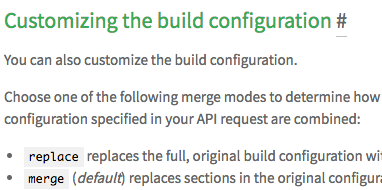

# Jekyll Pure Liquid Heading Anchors

[](https://github.com/allejo/jekyll-anchor-headings/actions?query=workflow%3A%22Unit+Tests%22)
[](https://github.com/allejo/jekyll-anchor-headings/releases/latest)
[](https://ko-fi.com/Q5Q4J7IX)
[](https://www.buymeacoffee.com/allejo)

GitHub Pages can't run custom Jekyll plug-ins so when generating anchors for your headings (i.e. `h1` - `h6`), you're stuck with JavaScript solutions that will inject anchors. But what if your users don't have JavaScript enabled on their browsers? If you're building a static website, why not make your anchors static as well?

<p align="center">
   
</p>

As a part of my "Pure Liquid" series of Jekyll snippets, here is a Liquid snippet that will modify your generated HTML to inject anchors. Want to see it in action? Here are some awesome websites that I know of using this solution :heart:.

- [Travis CI Docs](https://github.com/travis-ci/docs-travis-ci-com/pull/1909) (fixed in [#1960](https://github.com/travis-ci/docs-travis-ci-com/pull/1960))
- [Bitrise's Documentation](https://github.com/bitrise-io/devcenter/pull/291)
- [di's personal website](https://github.com/di/di.github.com/commit/4016cbdcc89ea1e42efafd55cda468764c350a71#diff-bc0451638729253193317f14b833a89e)
- [sitespeed.io](https://github.com/sitespeedio/sitespeed.io/commit/e9e33bbcb8dca21391f14d73d0ba52145f21f7ed)
- [Duality's developer docs](https://github.com/AdamsLair/duality-docs/commit/37370414fb312b59a52378f3d1f8bcd8c52e448d)
- [Australia's Vote Flux campaign](https://github.com/voteflux/flux-website-v2/commit/07f32e1db6e462595ded9ebac8496588bed8b6e7#diff-bc0451638729253193317f14b833a89e)
- [mlpack.org](https://github.com/mlpack/mlpack.org/commit/7320b0f760ccbc0eeb5d76a0e20a4d266e2775b6)
- [Riot.js website](https://github.com/riot/riot.github.io/blob/1a9749b97115b4169955820159e50bc72f137b7b/_includes/anchor_headings.html)
- ["Just the Docs" Jekyll theme](https://github.com/pmarsceill/just-the-docs/commit/03e2345833f92d6f3841db66bffd0f2ed8461bf2)
- [Microsoft's (former) TypeScript website](https://github.com/microsoft/TypeScript-Website/blob/52ca8592b221550af648fc0af9c231bf765eff8b/src/_includes/anchor_headings.html)
- [VMWare's Octant documentation](https://github.com/vmware-tanzu/octant/commit/4db5dee7eeee6e580df9519b07907ac40dbd87b0#diff-e093f684d412b760130734e02973c4d7)
- [TypeStrong's TypeDoc Website](https://github.com/TypeStrong/typedoc-site/commit/5a100f8faaa9cd34df69a12273be41c14856e2a6)
- [Under Armour's Jekyll Theme](https://github.com/underarmour/uadocs-jekyll-theme/blob/b27a564cb054307d0209cf277c2d7fa713ceb683/_includes/toc.html)
- [IRCv3 Working Group's website](https://github.com/ircv3/ircv3.github.io/pull/362)
- [Azure's IoT Identity Service](https://github.com/Azure/iot-identity-service/pull/204)
- [CivicActions' Accessibility website](https://github.com/CivicActions/accessibility/pull/271)
- [DuckDB's website](https://github.com/duckdb/duckdb-web/pull/48)
- [json-scheme.org website](https://github.com/json-schema-org/json-schema-org.github.io/pull/461)
- [termux.dev](https://github.com/termux/termux.github.io/commit/ec74c6f793cb9e06464cf2083018b4b72c1b2714)
- [DependencyTrack](https://github.com/DependencyTrack/dependency-track/pull/1845)

> **Want a Table of Contents in your Jekyll layouts without JavaScript or a plug-in?**
>
> Check out the sister project over at [allejo/jekyll-toc](https://github.com/allejo/jekyll-toc).

## Usage

Alright, so how do you use it?

1. Download the `anchor_headings.html` file from [the latest release](https://github.com/allejo/jekyll-anchor-headings/releases/latest) or [the master branch](_includes/anchor_headings.html)
2. Toss that file in your `_includes` folder
3. Where you typically would put `{{ content }}` in your layout, you would instead use this Liquid tag to output your page's content:

   ```liquid
   
   ```

### :wheelchair: Link Accessibility

Accessibility is hard and there are many different ways someone may want to handle it. For that reason, this project does not force onto developers any method of handling accessibility. That being said, this project can be [configured to be accessible as seen in examples in the wiki](https://github.com/allejo/jekyll-anchor-headings/wiki/Link-Accessibility).

### :warning: Layout Inheritance

If this snippet is used in a layout that is inherited by a child layout, it will apply to the child layout as well. If the child layout uses this snippet in addition to the parent layout, then heading anchors will be duplicated. You should only use this snippet in one layout.

### :art: Customization

You may remove `anchorBody` and add an icon via [CSS' `content` property](https://developer.mozilla.org/en-US/docs/Web/CSS/content) instead. You may also use HTML in `anchorBody` and add [screen reader friendly markup](_tests/customAnchorBody.html).

Take a look at the [unit tests directory](_tests/) and [the wiki page](https://github.com/allejo/jekyll-anchor-headings/wiki/Examples) for more examples of how to use this script.

## Parameters

This snippet is highly customizable. Here are the available parameters to change the behavior of the snippet.

| Parameter       |  Type  | Default | Description |
| --------------  | :----: | :-----: | ----------- |
| `html`          | string | <sup>*</sup> | the HTML of compiled markdown generated by kramdown in Jekyll |
| `beforeHeading` | bool   | false | Set to true if the anchor should be placed _before_ the heading's content |
| `headerAttrs`   | string | ''    | Any custom HTML attributes that will be added to the heading tag; you may NOT use `id`; the `%heading%` and `%html_id%` placeholders are available |
| `anchorAttrs`   | string | ''    | Any custom HTML attributes that will be added to the `<a>` tag; you may NOT use `href`, `class` or `title`; the `%heading%` and `%html_id%` placeholders are available |
| `anchorBody`    | string | ''    | The content that will be placed inside the anchor; the `%heading%` placeholder is available |
| `anchorClass`   | string | ''    | The class(es) that will be used for each anchor. Separate multiple classes with a space |
| `anchorTitle`   | string | ''    | The `title` attribute that will be used for anchors; the `%heading%` placeholder is available |
| `h_min`         | int    | 1     | The minimum header level to build an anchor for; any header lower than this value will be ignored |
| `h_max`         | int    | 6     | The maximum header level to build an anchor for; any header greater than this value will be ignored |
| `bodyPrefix`    | string | ''    | Anything that should be inserted inside of the heading tag _before_ its anchor and content |
| `bodySuffix`    | string | ''    | Anything that should be inserted inside of the heading tag _after_ its anchor and content |
| `generateId`    | bool   | false | Set to true if a header without id should generate an id to use. |

<sup>*</sup> This is a required parameter

## Performance

The performance impact of this snippet on your site is pretty negligible. The stats below were gotten from Jekyll's `--profile` option.

```
Filename                                         | Count |    Bytes |  Time
-------------------------------------------------+-------+----------+------

# performance on docs.travis-ci.com from ~Aug 2018
_includes/anchor_headings.html                   |   193 | 1667.96K | 0.695
```

## License

This snippet may be redistributed under the [MIT](LICENSE.md) license.
